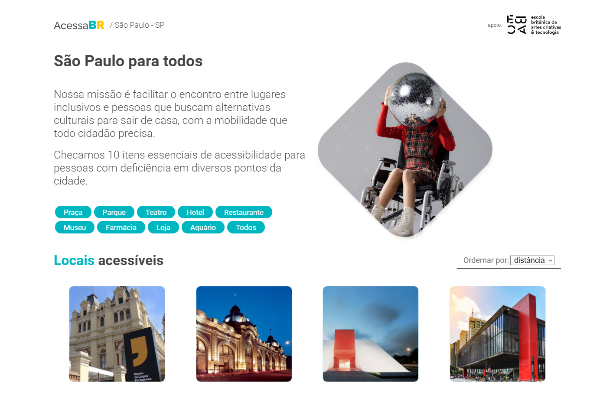

## Acessa BR

## Aplicação para auxiliar na descoberta de locais de lazer inclusivos

<h1 align="center">
  
</h1>

### 🛠 Tecnologias utilizadas
- [React.js](https://pt-br.reactjs.org)
- [JavaScript](www.javascript.com)
- [Vite](https://vitejs.dev)
- [Swiper](https://swiperjs.com)

### Features
- Rotas para desenvolver a aplicação para qualquer cidade e estado do Brasil;
- Controle de informações de acessibilidade para os locais;
- Filtro de tipos de locais de lazer acessíveis;
- Design Responsivo;

### Usage
Para instalação dos pacotes digite ```yarn``` ou ```npm install```

Para executar o projeto em modo de desenvolvimento, digite ```yarn dev``` ou ```npm run dev```

Pronto, a aplicação deve estar rodando em ```http://localhost:3000```

Certifique-se de usar um parâmetro para estado e para cidade, como: ```http://localhost:3000/RN/Natal```
